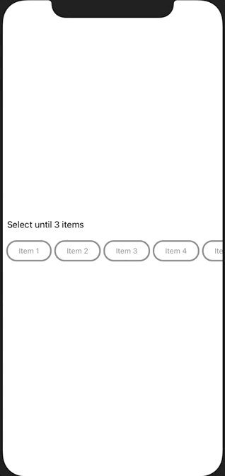

# TagMenu

[](https://travis-ci.com/lucianobohrer/TagMenu)
[](https://cocoapods.org/pods/TagMenu)
[](https://cocoapods.org/pods/TagMenu)
[](https://cocoapods.org/pods/TagMenu)

## Example

To run the example project, clone the repo, and run `pod install` from the Example directory first.

## Usage

### Single Selection


```swift
let viewModel = TagMenuViewModel<String>(items: [
    SelectableListItem(value: "Item 1", selected: true),
    SelectableListItem(value: "Item 2"),
    SelectableListItem(value: "Item 3"),
    SelectableListItem(value: "Item 4")
],
title: "",
selection: .single)

let view = TagMenuView<String>(viewModel: viewModel,
                               tagSettings: TagMenuSettings(highlightColor: .black,
                                                            regularColor: .gray,
                                                            backgroundColor: .white,
                                                            borderSize: 3))

cancellable = viewModel.selectedItemsSubject.sink { (values) in
    print(values)
}
```
### Multiple Selection


```swift
let viewModel = TagMenuViewModel<String>(items: [
    SelectableListItem(value: "Item 1"),
    SelectableListItem(value: "Item 2"),
    SelectableListItem(value: "Item 3"),
    SelectableListItem(value: "Item 4")
],
title: "Select until 3 items",
selection: .multiple(max: 3))

let view = TagMenuView<String>(viewModel: viewModel,
                               tagSettings: TagMenuSettings())

cancellable = viewModel.selectedItemsSubject.sink { (values) in
    print(values)
}
```

## Package 

### For Xcode Projects

File > Swift Packages > Add Package Dependency: https://github.com/lucianobohrer/TagMenu

### For Swift Packages

Add a dependency in your your `Package.swift`

```swift
.package(url: "https://github.com/lucianobohrer/TagMenu.git", from: "0.1.0"),
```

## CocoaPods 

TagMenu is available through [CocoaPods](https://cocoapods.org). To install
it, simply add the following line to your Podfile:

```ruby
pod 'TagMenu'
```

## Authors

- [lucianobohrer](https://github.com/lucianobohrer)
- [gabrielsilveiraa](https://github.com/gabrielsilveiraa)

## License

TagMenu is available under the MIT license. See the LICENSE file for more info.
